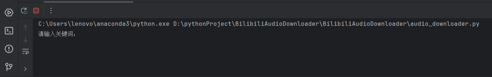

# BilibiliAudioDownloader
## 哔哩哔哩音频下载器

根据输入所需数据的关键词筛选粉丝数大于`10w`的博主的`uid`，任选一个`uid`输入即可开始下载该up主主页所有视频的音频信息的下载。


## 调包
1. 安装python**3.8**或以上版本
2. 进入cmd界面 
```Plain
pip install BilibiliAudioDownloader
```

```Plain
python
```

```Plain
import BilibiliAudioDownloader
```
- 请输入关键词：  

- 输入关键词后会输出粉丝数大于`10w`的博主的`uid`  
- 任选一个uid输入开始下载，过程中会在当前目录下创建data文件夹和audio_download文件夹，有的话则不会创建

## 自行构建步骤
1. 从Github下载audio_downloader.py文件中的代码
2. 安装python**3.8**或以上版本
3. 使用pip指令安装依赖  
```Plain
requests
lxml
selenium
```
4. 直接运行代码，运行成功会显示类似如下所示内容


5. 输入关键词后会输出粉丝数大于`10w`的博主的`uid`
6. 任选一个uid输入开始下载，过程中会在当前目录下创建data文件夹和audio_download文件夹，有的话则不会创建
```plain
data
├──uids.txt
└──audio_contents.csv

audio_download
```
（1）`uids.txt`文件中包含大于`10w`粉丝博主的`uid`  
（2）`audio_download`文件用于存储下载好的音频

